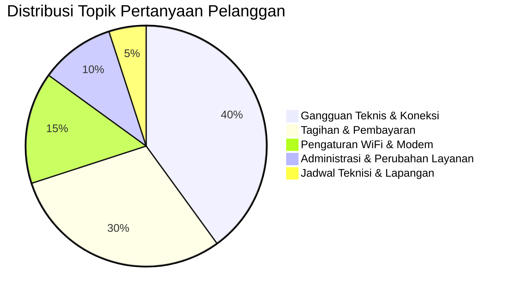

# Panduan & Template Pesan Repetitif Customer Service ISP (FTTH)

Dokumen ini berisi kumpulan inventarisasi pertanyaan berulang (_frequently asked questions / repetitive queries_) dari pelanggan layanan internet rumah (FTTH ISP), akar penyebab kendala, dan rancangan template jawaban otomatis (_quick reply / auto-bot template_) yang telah dioptimalkan untuk Live Chat, WhatsApp, dan Mobile Portal.

---

## 1. Distribusi Kategori Pertanyaan Pelanggan

Berdasarkan data operasional ISP FTTH, lebih dari **85% interaksi obrolan** terpusat pada 5 topik berikut:



---

## 2. Inventarisasi Pertanyaan & Template Jawaban

### Kategori 1: Gangguan Teknis & Koneksi (40%)

#### 1.1 Kendala WiFi Lambat / Sinyal Lemah

- **Kode Menu**: `1.1`
- **Kata Kunci Trigger**: `lemot`, `lambat`, `patah-patah`, `buffer`, `lelet`, `kecepatan`, `speed`
- **Akar Masalah**:
  - Modem belum pernah di-restart (cache sistem penuh / memory leak).
  - Terlalu banyak perangkat tersambung secara bersamaan.
  - Hambatan fisik (dinding beton tebal, lantai bertingkat, atau interferensi gelombang).
  - Jangkauan sinyal frekuensi 2.4 GHz vs 5 GHz.
- **Template Jawaban Otomatis**:
  > **Solusi Cepat Mengatasi WiFi Lambat:**
  >
  > 1. **Restart Modem (ONT)**: Cabut adaptor daya listrik di belakang modem selama 30 detik, lalu tancapkan kembali.
  > 2. **Gunakan Frekuensi 5 GHz**: Jika perangkat Anda dan modem mendukung pita 5 GHz, sambungkan ke nama WiFi berakhiran `_5G` untuk kecepatan maksimal.
  > 3. **Periksa Perangkat Terhubung**: Matikan sementara sambungan WiFi pada perangkat yang sedang mengunduh file besar atau pembaruan otomatis (update game/OS).
  > 4. **Uji Kecepatan**: Lakukan pengujian ulang kecepatan di dekat modem melalui situs [speedtest.net](https://www.speedtest.net).
  >
  > _Masih mengalami kendala? Silakan ketik **2** atau tekan tombol di bawah untuk terhubung dengan Teknisi._

---

#### 1.2 Lampu Indikator LOS Berkedip / Menyala Merah

- **Kode Menu**: `1.2`
- **Kata Kunci Trigger**: `los`, `lampu merah`, `tanda silang`, `kabel putus`, `tidak ada internet`
- **Akar Masalah**:
  - Kabel _patch cord_ optik (kuning/hitam kecil) tertekuk, terjepit, atau konektornya longgar.
  - Kabel _drop core_ luar putus akibat tersangkut kendaraan, tertimpa dahan pohon, atau pengerjaan drainase/jalan.
  - Terjadi gangguan massal di level ODP (_Optical Distribution Point_) atau OLT pusat.
- **Template Jawaban Otomatis**:
  > **Penanganan Lampu Indikator LOS Merah:**
  >
  > Lampu LOS merah menunjukkan bahwa modem Anda **tidak menerima sinyal optik** dari jaringan pusat:
  >
  > 1. Periksa kabel optik (kabel tipis warna kuning/hitam) di bagian bawah/belakang modem. Pastikan konektor terpasang rapat dan kabel **tidak tertekuk patah atau terjepit**.
  > 2. **PERHATIAN**: Jangan mencabut paksa atau menatap langsung ke ujung konektor optik karena terdapat radiasi laser tak kasat mata.
  > 3. Jika kabel di rumah dalam kondisi baik namun lampu tetap merah, kemungkinan terdapat kendala fisik pada kabel luar.
  >
  > _Tekan tombol **[Hubungkan ke CS]** agar tim kami dapat segera menerbitkan tiket penanganan teknisi ke lokasi Anda._

---

#### 1.3 Edukasi: Larangan Menekan Tombol Reset Fisik

- **Kode Menu**: `1.3`
- **Kata Kunci Trigger**: `reset`, `tombol kecil`, `tusuk jarum`, `kembali ke pabrik`, `nama wifi berubah`
- **Akar Masalah**:
  - Pelanggan berniat me-restart modem namun menusuk lubang kecil berlabel _RESET_, sehingga data akun PPPoE dan VLAN terhapus total.
- **Template Jawaban Otomatis**:
  > ⚠️ **PERINGATAN PENTING: Jangan Menusuk Tombol Reset Modem**
  >
  > Menusuk tombol reset fisik di belakang modem akan **menghapus seluruh settingan username, password internet (PPPoE), dan konfigurasi jaringan**. Hal ini menyebabkan modem mati total dan tidak bisa terhubung ke server.
  >
  > **Cara Me-restart yang Benar:**
  > Cukup cabut adaptor listrik modem selama 30 detik lalu colokkan kembali.
  >
  > _Jika tombol reset sudah terlanjur tertusuk dan internet mati, silakan hubungkan ke CS untuk dilakukan pengaturan ulang (remote setting / kunjungan teknisi)._

---

### Kategori 2: Tagihan & Pembayaran (30%)

#### 2.1 Pengecekan Total Tagihan & Jatuh Tempo

- **Kode Menu**: `2.1`
- **Kata Kunci Trigger**: `tagihan`, `invoice`, `jatuh tempo`, `berapa bayar`, `total tagihan`
- **Template Jawaban Otomatis**:
  > **Informasi Tagihan & Jatuh Tempo:**
  >
  > Rincian tagihan Anda dapat diakses secara _real-time_ melalui menu **Home / Riwayat Tagihan** pada aplikasi ini.
  >
  > - **Tanggal Cetak Invoice**: Tanggal 1 setiap bulannya.
  > - **Batas Waktu Pembayaran**: Tanggal 10 atau 20 (sesuai paket langganan Anda).
  >
  > Pembayaran dapat dilakukan via:
  >
  > - Virtual Account (BCA, Mandiri, BRI, BNI)
  > - Scan QRIS (Semua E-Wallet / Mobile Banking)
  >
  > _Pastikan pembayaran dilakukan sebelum tanggal jatuh tempo untuk menghindari pemutusan sementara (isolir) otomatis oleh sistem._

---

#### 2.2 Konfirmasi Pembayaran (Internet Belum Aktif / Masih Isolir)

- **Kode Menu**: `2.2`
- **Kata Kunci Trigger**: `sudah bayar`, `sudah transfer`, `masih isolir`, `masih suspend`, `buka blokir`
- **Akar Masalah**:
  - Sinkronisasi callback payment gateway memerlukan waktu 1–3 menit.
  - Modem belum mengambil IP baru setelah status di-unblock dari MikroTik.
- **Template Jawaban Otomatis**:
  > **Konfirmasi Pembayaran Berhasil:**
  >
  > - Jika pembayaran dilakukan via **Virtual Account / QRIS resmi**, sistem akan otomatis membuka blokir dalam waktu **1–5 menit**.
  > - **Langkah Tambahan**: Silakan matikan dan hidupkan kembali (restart) modem Anda agar perangkat mengambil IP internet baru.
  > - Jika Anda membayar via transfer manual atau internet belum aktif lebih dari 10 menit, silakan kirimkan foto bukti transfer di sini agar diverifikasi langsung oleh Admin Keuangan.

---

### Kategori 3: Pengaturan Perangkat & Sandi WiFi (15%)

#### 3.1 Ubah Nama WiFi (SSID) dan Kata Sandi

- **Kode Menu**: `3.1`
- **Kata Kunci Trigger**: `ganti password`, `ganti sandi`, `ubah nama wifi`, `ganti ssid`
- **Template Jawaban Otomatis**:
  > **Panduan Mandiri Ubah Password WiFi:**
  >
  > 1. Sambungkan HP/Laptop ke jaringan WiFi rumah Anda.
  > 2. Buka browser (Chrome/Safari) dan ketik alamat IP: `192.168.1.1` (atau `192.168.100.1`).
  > 3. Masukkan username & password modem Anda (tertera di stiker bawah modem).
  > 4. Masuk ke menu **Network / WLAN / Wireless** ➡️ cari kolom **WPA Passphrase / PreSharedKey**.
  > 5. Ubah kata sandi baru (minimal 8 karakter kombinasi huruf dan angka), lalu klik **Apply / Save**.
  >
  > _Jika kesulitan atau tidak mengetahui sandi admin modem, silakan tekan **[Hubungkan ke CS]** agar dapat kami bantu ubah dari sistem pusat._

---

### Kategori 4: Administrasi & Perubahan Layanan (10%)

#### 4.1 Permintaan Upgrade / Downgrade Paket Kecepatan

- **Kode Menu**: `4.1`
- **Kata Kunci Trigger**: `upgrade`, `tambah kecepatan`, `naik paket`, `ganti paket`, `turun paket`
- **Template Jawaban Otomatis**:
  > **Pilihan Upgrade Paket Internet:**
  >
  > Nikmati koneksi lebih cepat dan stabil untuk seluruh keluarga.
  > *(Daftar paket, kecepatan Mbps, dan harga bulanan diambil secara dinamis dari tabel `paket_layanan` di database sesuai brand pelanggan).*
  >
  > _Perubahan paket dapat langsung diproses pada hari yang sama. Ketik **2** atau tekan tombol **[Hubungkan ke CS Manusia]** untuk mengajukan perubahan paket kepada tim kami._

---

#### 4.2 Pemindahan Lokasi Pasang (Relokasi / Pindah Rumah)

- **Kode Menu**: `4.2`
- **Kata Kunci Trigger**: `pindah rumah`, `relokasi`, `pindah alamat`, `geser modem`
- **Template Jawaban Otomatis**:
  > **Ketentuan Relokasi Layanan:**
  >
  > 1. Layanan dapat dipindahkan selama alamat tujuan berada dalam jangkauan jaringan kabel kami.
  > 2. Mohon kirimkan **Share Location alamat baru** & **Foto tiang/ODP terdekat** di obrolan ini untuk pengecekan jaringan.
  > 3. Perangkat modem (ONT) dan adaptor dibawa sendiri oleh pelanggan ke lokasi baru.
  > 4. Jadwal penarikan kabel baru akan diatur oleh tim teknis kami.

---

### Kategori 5: Kunjungan Teknisi & Jam Operasional (5%)

#### 5.1 Informasi Jam Operasional & Status Kunjungan

- **Kode Menu**: `5.1`
- **Kata Kunci Trigger**: `jam operasional`, `jam buka`, `kapan teknisi datang`, `nomor teknisi`
- **Template Jawaban Otomatis**:
  > **Jam Operasional Layanan:**
  >
  > - **Customer Support & Helpdesk**: Setiap Hari pukul **08:00 – 22:00 WIB** (Layanan Chat & WhatsApp).
  > - **Kunjungan Teknisi Lapangan**: Setiap Hari (Senin – Minggu) pukul **08:30 – 17:00 WIB**.
  >
  > _Untuk tiket gangguan yang masuk setelah jam 17:00 WIB, kunjungan fisik akan dijadwalkan pada hari berikutnya mulai pukul 08:30 WIB._

---

## 3. Matriks Alur Otomasi (Decision Tree)

```text
[Pelanggan Membuka Chat]
          │
          ├── Pilihan 1: [📋 1. Bantuan Cepat / FAQ]
          │       ├── 1.1 WiFi Lambat ───────► Tampilkan Solusi Restart & 5GHz
          │       ├── 1.2 Lampu LOS Merah ───► Tampilkan Cek Kabel Fisik + Opsi Tiket
          │       ├── 1.3 Info Tagihan ──────► Tampilkan Panduan Cek & VA
          │       ├── 1.4 Restart Modem ─────► Edukasi Jangan Tusuk Tombol Reset
          │       └── 1.5 Jam Operasional ───► Tampilkan Jadwal CS & Teknisi
          │
          └── Pilihan 2: [👤 2. Hubungkan ke CS]
                  └── Alihkan Sesi ke Antrean Representatif Customer Support
```
